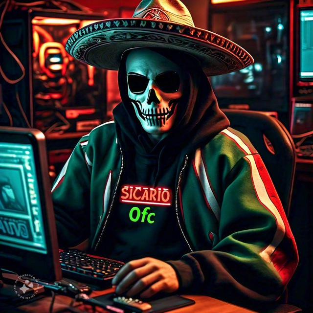

<div align="center" id="top"> 
  
</div>

<p align="center">



<h1 align="center">SICARIOBOT🤖</h1>
 
</p>
<div align="center">
<P align="left">
<a href="https://www.youtube.com/@nms_sicario023" target="blank"></a>
<a href="https://t.me/mds_inmunes" target="blank">
<a href="https://teamzetasprivate.kesug.com" target="blank"></a>
<a href="mailto:teamzetasprivatev1@gmail.com?subject=Consulta&body=Hola,%20me%20gustaría%20saber%20más%20sobre..." target="blank">
</P>
</div>

 <h4 align="center"> 
	🚧  SicarioBot 🚀 Bajo construcción...  🚧
</h4> 

## Acerca del bot ##

Este proyecto fue realizado con el proposito de crear un bot para Telegram con la ayuda del lenguaje de Python y añadiendo distintas bibliotecas en ello. La función que tiene es realizar distintas busquedas de archivos a travez de los comandos con la ayuda de inteligencia artificial, asi como el registro de los usuarios. El bot fue creado por su servidor SicarioOfc, para que los usuarios lo ocupen a su gusto. Si te gusto este bot me apoyaria mucho dandole click a la estrella⭐ para agregarlo a tus favoritos y estar al tanto de las actualizaciones y cambios que se vayan realizando.

## Requisitos necesarios ##

Python;\
Un editor de código o IDE (Usaremos Visual Studio Code);\
PowerShell7;\
Registrarse en Google Custom Search;

## Lenguajes y herramientas usados ##

Estos son los lenguajes y herramientas que se ocupo para el proyecto:

- [Python](https://www.python.org/downloads/)
- [ffmpeg](https://www.gyan.dev/ffmpeg/builds/)
- [Git](https://git-scm.com/)
- [java](https://www.java.com/es/download/ie_manual.jsp)
- [Visual Studio Code](https://code.visualstudio.com/)
- [PowerShell7](https://github.com/powershell/powershell/releases)
- [Google Cloud Console](https://console.cloud.google.com)
- [Custom Search](https://programmablesearchengine.google.com/controlpanel/all)

## Requerimientos necesarios ##

Necesitaras tener instalado [Git](https://git-scm.com) y [Python](https://www.python.org/downloads/) para poder clonar y correr el proyecto correctamente.

## Funciones a realizar ##

```bash
# Actualizar lista de paquetes del sistema
$ sudo apt update
$ apt list --upgradable
$ sudo apt upgrade
# Instalar Python
$ sudo apt install python
# Si no funciona, instalar Python3
$ sudo apt install python3
# Instalar ffmpeg
$ sudo apt install ffmpeg -y
# Clonar el proyecto
$ git clone https://github.com/programador024/SicariBot.git
# Acceder
$ cd SicariBot
# Para activar el entorno virtual
$ .venv\Scripts\Activate.ps1
# Instalar librerias
$ python -m pip install --upgrade pip
$ pip install python-telegram-bot
$ pip install pytelegrambotapi
$ pip install google-api-python-client
$ pip install beautifulsoup4
$ pip install pytube
$ pip install pydub
$ pip install yt-dlp
$ pip install pillow
$ pip install pytz
# Para desactivar el entorno virtual
$ .venv\Scripts\deactivate
# Correr el proyecto
$ python mibot.py

# En caso de que no jale pytube, ejecutar la siguiente libreria
$ pip install git+https://github.com/pytube/pytube
```

## Licencia ##

Este proyecto fue creado: by <a href="https://github.com/programador024" target="_blank">SicarioOfc</a>

Prohibido la copia de información, este repositor solo es una ayuda para la creación de sus bots, toda la información mostrada pertenece a su creador, cualquier duda o pregunta puedes contactarme al siguiente correo <a href="mailto:teamzetasprivatev1@gmail.com?subject=Consulta&body=Hola,%20me%20gustaría%20saber%20más%20sobre..." style="text-decoration: none;" target="_blank">teamzetasprivatev1@gmail.com</a>.

&#xa0;

<h2 tabindex="-1" class="heading-element" dir="auto">GitHub-Contribución y Lenguaje </h2>
<!--- stats & Trophy (start) -->
<p align="center">
  <!--- stats (start) -->
<table align="left">
<tr border="none">
<td width="60%" align="center">

   
</td>

<td width="40%" align="center">

  

  </td>
</tr>
</table>
</p>

  <br>
<br><br>

<a href="#top">Volver arriba</a>
